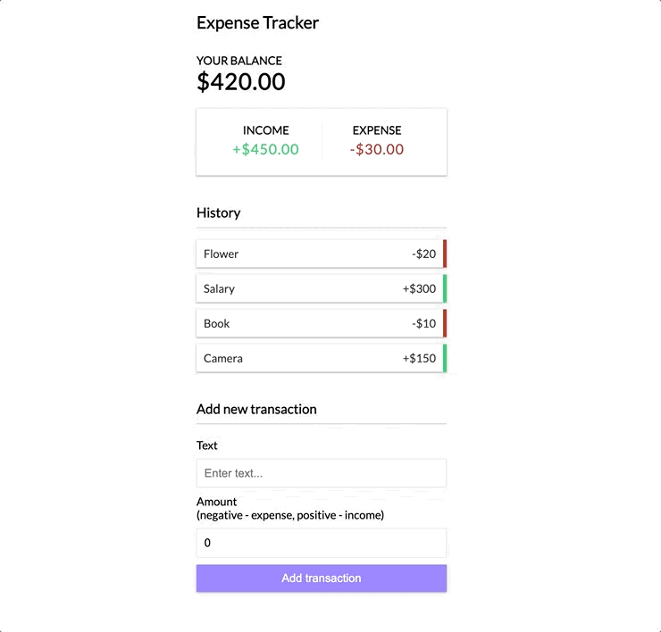

# Expense Tracker Demo App

  

I built this demo app for the sake of learning about React's Context API and practicing hooks. I followed along with [Brad Traversy's React Context YouTube tutorial](https://www.youtube.com/watch?v=XuFDcZABiDQ&t=751s).

## Summary

This app consists of a React UI that is run locally. Dummy data is initialized in state, and upon restarting the app any user-provided data will be erased and the dummy data will be re-initialized.

The concept of the app is an expense tracker that allows users to:

1. See their current balance
2. See a total of their income and a total of their expenses
3. See their transaction history
4. Delete a transaction
5. Add a transaction
